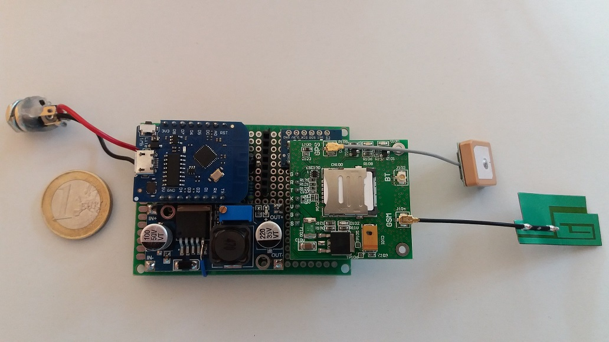
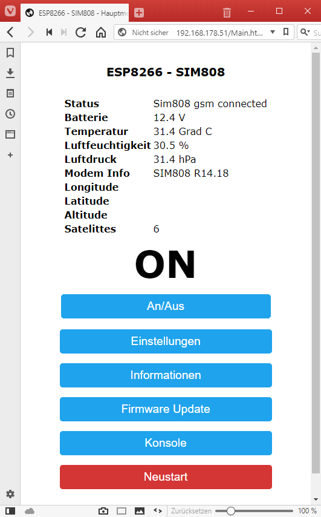
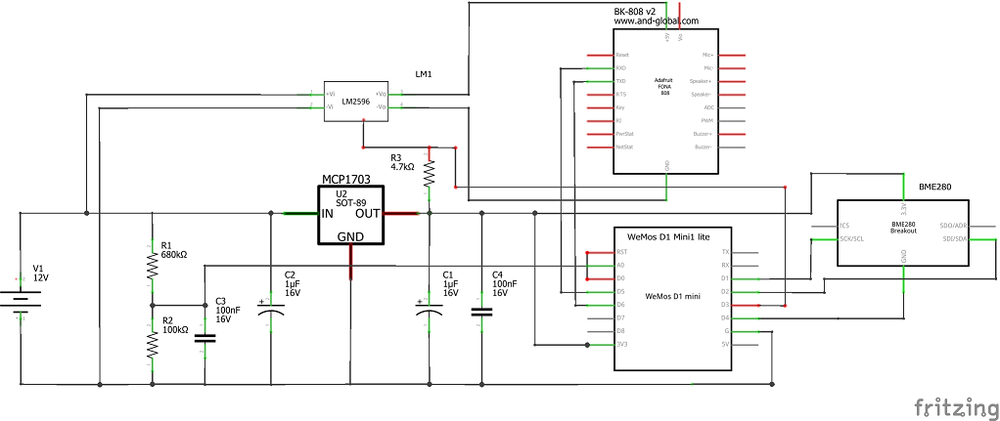
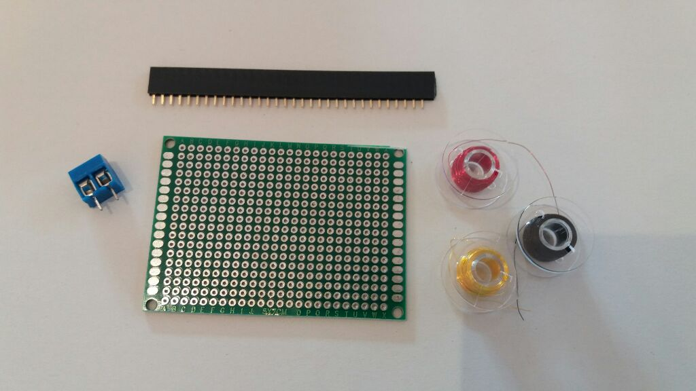
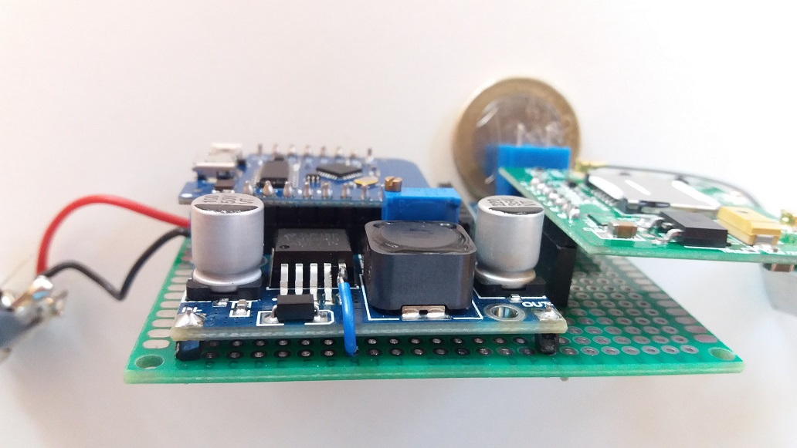
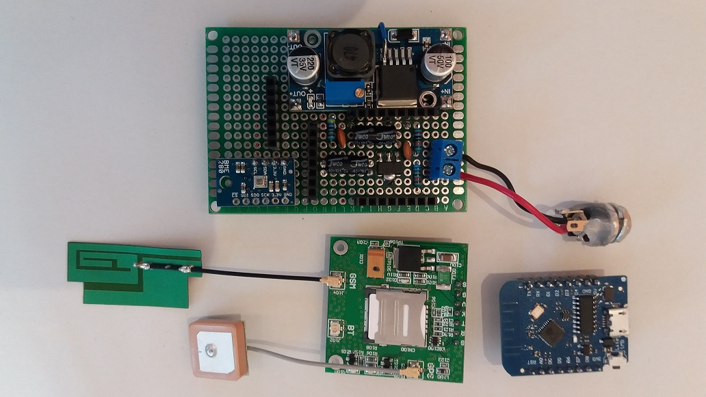
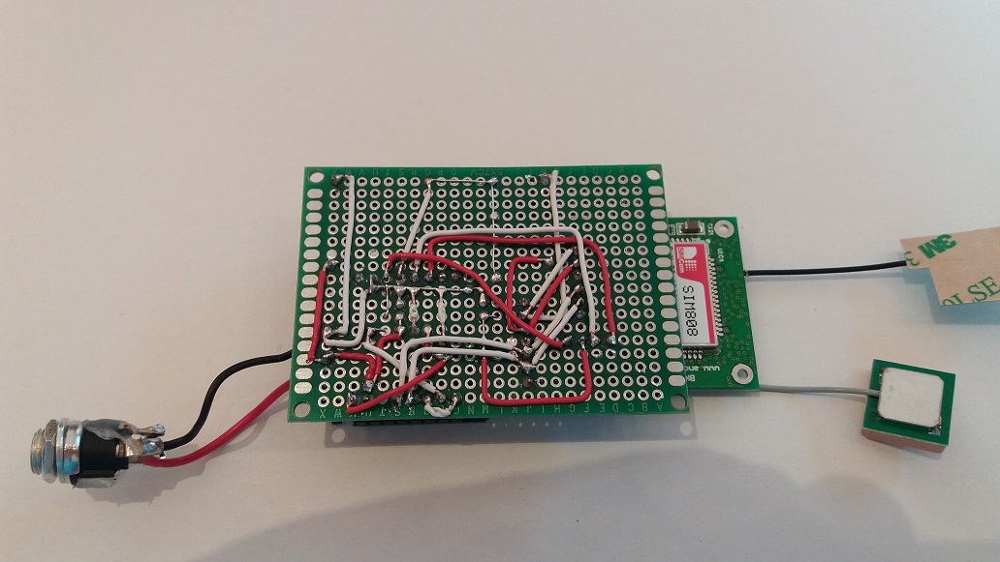

## SnorkTracker
   **GPS IoT tracker board for scanning gps and environment information and sending them to an MQTT server via GPRS.**

   

   

### Description
   The goal of this board is to have an easy-to-use, configurable GPS tracker that passes its data to an MQTT server. 
   It should also be able to scan other environmental data and operate on a 12V power supply with low power consumption 
   over a long period of time.

   The main components of the systems are:
   * A 'Wemos D1 mini lite' to run the software.
   * A BK-808 v2 (SIM808) GPS/GPRS module to communicate with an MQTT server and to send/receive SMS.
   * A BME280 module to scan environmental data.
   * An LM2596 DC-DC converter to supply the GPS/GPRS board.
   * An MCP1703 for the 3.3V Wemos power supply.

   To interact with the board it has an easy-to-use browser interface to show the
   scanned values, configure the system or to debug at runtime via console. 
   It can connect to an existing wlan or function as an access point.

   The board has a voltage divider to measure the power supply voltage and
   a BME280 sensor to read temperature, humidity and air pressure.

   The module operates with a supply voltage of approx. 6V to 16V. Perfect for a car battery.

   For power saving the supply voltage can be used to decide if the battery is charging or not
   and so the system can be configured to go into deep sleep mode which uses only ~0.3mA.

   With the GSM chip, the system can receive SMS commands to set default values or send current
   information such as GPS or temperature.

   The system estimates the current power consumption in mAh in energy saving mode and when the sim module is on. 

   You can also use the software on a esp8266 chip like the wemos d1 for having a serial console over HTTP if you connect
   to the D5 and D6 pin.

### Disclaimer
   I don't take any responsibility nor liability for using this software nor for the 
   installation or any tips, advice, videos, etc. given by any member of this site or any related site.

### License
   This program is licensed under GPL-3.0

### Source Code
   The easiest way to understand what the program does is to navigate by the main source modules via the Arduino IDE or 
   to explore the source code via
   [**DoxyGen generated documentation**](https://bastelschlumpf.github.io/SnorkTracker).  
   You can update the DoxyGen generated documentation by installing Doxygen (from http://www.doxygen.org) on your machine 
   and run the DoxyGen generation batch **Doxygen.bat** from the main folder.

### User manual of the web interface
  [See user-manual](USERMANUAL.md)

### Prerequisites
   * Arduino IDE
   * ESP8266 Board software
   * ESP8266 file-system up-loader
   * **SnorkTracker** software
   * Parts from the part-list
   * Micro-USB cable
   * Soldering iron kit
   * Multimeter
   * Electronics tools

### Setup Arduino Environment
   * Download Arduino IDE from  
     https://www.arduino.cc/en/Main/Software  
     and follow the installation instructions.
   * Install ESP8266 board software
      *  In Arduino IDE set 'File | Preferences' to Boards Manager URL 
         http://arduino.esp8266.com/stable/package_esp8266com_index.json  
      * Open 'Tools | Board... | Boards Manager...' 
        and search for 'esp8266' and install the software package
   * Install the ESP8266 file-system up-loader from  
      https://github.com/esp8266/arduino-esp8266fs-plugin  
      and follow the installation instructions.
   * Download **SnorkTracker** software by clone or download.
   * Copy the content of the snorktracker/libraries directory to the Arduino installation libraries directory.
     For example c:/Program Files (x86)/Arduino/libraries/
   * Configure Arduino IDE
     * From 'Tools | Boards' choose 'LOLIN(WEMOS) D1 mini Lite'
     * Change 'Tools | Flash Size' to '1M (64k SPIFFS)'
     * Change 'Tools | IwIP variant' to 'v14 Higher Bandwidth' 

### Circuit
   

### Assemble the Components
   * Take the Breadboard and the other items from the part-list.  
     
   * First of all unsolder the (ON/OFF) pin 5 from the DC-DC module, bend it up and
     solder a line to it. After that put 4 spacers under the DC-DC module and solder it
     to the breadboard. Check that the bottom of the LM2596 module is not in contact with the board.
     See  
     
   * Place the other parts from the part-list on the breadboard and solder it as shown. 
     Pay attention to the polarity of the capacitors!
     Split the header connector to the length that is needed and solder it. 
     A header connector is needed because flashing of the Wemos module often does not work 
     if it is still connected to the board.
     Check if the Wemos and SIM808 module has enough space and fits into the pins.  
     
   * Connect all the pins of the parts as seen on the circuit image with wires.  
     
   * The final board could look like this  
     
   * Check all the wiring with a multimeter. Also against short-circuit.

### Setup the LM2596 voltage and install the software
   * The first step we have to do is to set the right 5V for the SIM808 module.
     * For that unplug the Wemos and the SIM808 module.
     * Connect a 12 power supply to the screw connector. Make sure + and - are correct!
     * Switch on the LM2596 module by connecting the unsoldered pin 5 to ground. 
     * Now, connect the multimeter to the output pins of the DC-DC module and screw on
        the module resistor until the multimeter shows exactly 5.0V on the two out-pins.
   * Check the pins on the female header connector for the right voltage.
     * Check the 3.3V on the corresponding WEMOS pin.
     * Check the 5.0V pin of the SIM808 module connector pin.
     * Check the 3.3V on the BME280 module. Be aware that the ground pin is connected to
        the Wemos module and still open.
   * Now its time to flash the software to the Wemos module.
     * Unplug the Wemos module (if plugged) and connect it with the USB cable to your computer.
       After connecting via usb you should be able to select the arduino port under 'Tools | Port | ...'.
     * Open the tracker.ino file in the tracker folder and check the Arduino environment settings.
     * Upload the SPIFFS files with the 'Tools | ESP8266 Sketch data upload' menu.
       The SPIFFS files (htmls, styles and javascripts) are taken from the data subdirectory.
     * After that go to the *Config.h* file of the project and enter the right configuration values.
     * Now we can flash the program to the Wemos chip by clicking 'Sketch | upload'
     * Unplug and plug again the Wemos module to the usb cable and start immediately the serial monitor 
       of the Arduino IDE 'Tools | Serial monitor'.
     * If everything is correct you can see an access-point in the WLAN of your computer and you can connect 
       to the browser interface by calling the ip in your browser.
       The software works in a captive way, so you can enter a dummy (not https) url and the system should redirect you 
       to the web interface. For example http://dummy.com
       If this does not work find out the new ip via your WLAN router interface.
   * If the software works fine on the usb cable then you can plug the wemos into the board and connect a power supply.
     Check again the connectivity.

### Function
   * The software in the Wemos module creates a web-server in station and/or in access-point mode.
   * The analog input of the wemos is connected to the middle of the two voltage divider resistors.
     So it can read the power supply voltage of the system (for example the car battery voltage).
   * The software can be configured to recognize a charging or discharging car battery to switch on or off the 
     submodules. With my car this was:
     * 11.8 Volt if the car was switched off for more than a day.
     * 14.2 Volt if the engine is running.
     * 13.3 Volt after switching off the engine.
   * A BME280 sensor is connected to the 3.3V power and can be switched on by setting the D4 pin of the wemos chip
     to ground. This is done only from time to time to save energy.
   * There is an LM2596 DC-DC module on the board which can be switched on by a '-' signal to the pin 5 of the LM2596.
     Behind the DC-DC module there is a SIM808 module with GPS/GPRS/GSM functionality. So the Wemos can switch on/off 
     the SIM808 chip to save energy.
   * The Wemos chip can communicate with the SIM808 module via RX and TX signal and AT commands.
   * Via the GPRS module it can send the scanned data to a MQTT server and can communicate via SMS to a phone.

### Part-list
|Label              |Part Type                |Properties        |
|-------------------|-------------------------|------------------|
|Breadboard         |Double sided PCB board   |24 x 18 holes     |
|Power connector    |Mount screw connector    |2 pins            |
|Header connector   |Female header connector  |3 x 9 pins        |
|wire               |colored breadboard wire  |i.e. 0.14 mm2     |
|V1                 |VC Power                 |6V - 16V          |
|WeMos D1 Mini lite |WeMos D1 Mini lite       |ESP8295           |
|BK-808v2           |BK-808 v2                |www.and-global.com|
|GPS Antenna        |Embedded GPS Antenna     |uFL connector     |
|GSM Antenna        |Embedded GSM Antenna     |uFL connector     |
|SIM card           |SIM card for sms/data    |with deposit      |
|BME280             |BME280                   |3.3V              |
|LM1                |LM2596                   |adjustable module |
|U2                 |Voltage Regulator 3.3V   |MCP1703T-3302E    |
|C1                 |Electrolytic Capacitor   |1uF (16V)         |
|C2                 |Electrolytic Capacitor   |1uF (16V)         |
|C3                 |Ceramic Capacitor        |100 nF (16V)      |
|C4                 |Ceramic Capacitor        |100 nF (16V)      |
|R1                 |Resistor                 |680 kOhm          |
|R2                 |Resistor                 |100 kOhm          |
|R3                 |Resistor                 |4.7 kOhm          |

### Shopping list
Here are some sample shopping items. Please check the details if everything is correct.

|Label              |Price      |Sample URL        |
|-------------------|-----------|------------------|
|Breadboard set     |13$        | https://www.amazon.com/Paxcoo-Double-Prototype-Connector-Terminal/dp/B07C3TC68Z |
|wire               |13$        | https://www.amazon.com/StrivedayTM-Flexible-Silicone-electronic-electrics/dp/B01KQ2JN |
|WeMos D1 Mini lite |10$ 2 pcs  | https://www.amazon.com/Aideepen-Development-ESP8285-V1-0-0-Internet/dp/B07BGW7QG |
|BK-808v2           |22$        | https://www.amazon.com/Breakout-Quad-band-GSMGPRS-Integrated-GPSBluetooth/dp/B0748DGCRN |
|GPS Antenna        |9$         | https://www.amazon.com/CIROCOMM-Antenna-Ceramic-25x25x2mm-Geekstory/dp/B078Y2WNY6 |
|GSM Antenna        |6$         | http://www.amazon.com/CIROCOMM-Antenna-Ceramic-25x25x2mm-Geekstory/dp/B078Y2WNY6 |
|BME280             |10$        | https://www.amazon.com/Breakout-Temperature-Humidity-Barometric-Pressure/dp/B01LETIESU |
|LM1                |7$ 2pcs    | https://www.amazon.com/DZS-Elec-Adjustable-Electronic-Stabilizer/dp/B06XRN7NFQ |
|U2                 |1$         | https://www.mouser.ch/ProductDetail/Microchip-Technology/MCP1703T-3302E-DB?qs=sGAEpiMZZMsGz1a6aV8DcJ7KfjtCj7XdHFS3qTrbY5w%3d |
|C1, C2             |10$ set    | https://www.amazon.com/WINGONEER-Electrolytic-Capacitors-Assorted-Assortment/dp/B0734T3GJ9 |
|C3, C4             |13$ set    | https://www.amazon.com/Terrans-Monolithic-Multilayer-Capacitors-Non-Polarized/dp/B07B91SW4Y |
|R1, R2, R3         |10$ set    | https://www.amazon.com/Resistor-Assortment-Kit-Thermistor-Photoresistor/dp/B0792M83JH |

Some of the items are sets for further projects. You can also buy cheaper single items.
The material price should be between **50$** and **100$**.

### Thanks
   * https://www.arduino.cc
     *Thanks to the Arduino community with all its incredible possibilities and support.** 
   * https://github.com/arendst/Sonoff-Tasmota
     *Thanks to Theo Arends for his great home automation software project with all the detailed esp functionality.*
   * http://fritzing.org/home
     *Thanks to the fritzing team for this very intuitive usable software.* 
     I could create my circuit in Fritzing with only a half day.
   * https://marketplace.visualstudio.com/items?itemName=MadsKristensen.MarkdownEditor
     *Thanks to Mads Kristensen for his helpful Visual Studio MarkDown PlugIn.**
   * **And a special thanks goes to my brother for all the hours he spent helping me with the electronic circuit.**
