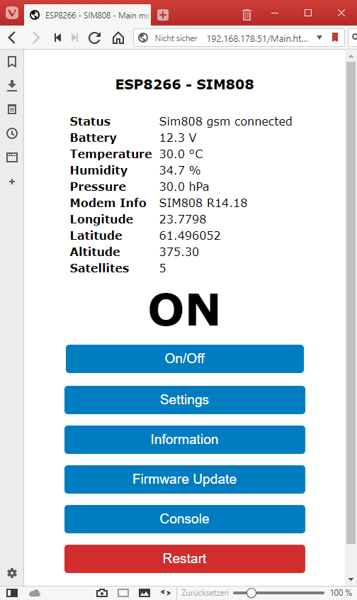

## SnorkTracker
   **GPS IoT tracker board for scanning gps and environment information and sending this to a MQTT server via GPRS.**

    

   

### Description
   The goal of this board is to have an easy-to-use, configurable GPS tracker that passes its data to an MQTT server. 
   It should also be able to scan other environmental data and operate on a 12V power supply with low power consumption 
   over a long period of time.

   The main components of the systems are:
   * A 'Wemos D1 mini lite' to run the software.
   * A BK-808 v2 (SIM808) GPS/GPRS Modul to communicate with a MQTT server and send/receive SMS.
   * An BME280 modul to scan environment.
   * An LM2596 DC-DC converter to supply the GPS/GPRS board.
   * An MCP1703 for the 3.3V Wemos power supply.

   To interact with the board it has an easy-to-use browser interface to show the
   scanned values, configure the system or to debug at runtime via console. 
   It can connect to an existing wlan or can work as an access point.

   The board has an resistor divider to scan the 'power supply voltage' and
   a BME280 sensor to read the temperature, humidity and pressure.

   It can works on a typically car battery voltage from 10V to 16V.

   For saving power the 'supply voltage' can be used to decide if the battery is on loading or not
   and so the system can configured to go into deep sleep mode which uses only ~0.3mA.

   With the GSM chip the system can interact with sms commandos to set default values or send 
   current information like gps or temperature.

### Disclaimer
   I don't take any responsibility nor liability for using this software nor for the 
   installation or any tips, advice, videos, etc. given by any member of this site or any related site.

### Prerequisites
   * Arduino IDE
   * ESP8266 Board software
   * ESP8266 filesystem uploader
   * **SnorkTracker** software
   * Parts from the partlist
   * Micro-USB cable
   * Soldering iron kit
   * Multimeter
   * Electronics tool

### Setup Arduino Environment
   * Download Arduino IDE from https://www.arduino.cc/en/Main/Software and
     follow the installation instructions.
   * Install ESP8266 board software
      *  In Arduino IDE set 'File | Preferences' to Boards Manager URL http://arduino.esp8266.com/stable/package_esp8266com_index.json 
         and select OK.
      * Open 'Tools | Board... | Boards Manager...' 
        and search for 'esp8266' and install the software package
   * Install the ESP8266 filesystem uploader from https://github.com/esp8266/arduino-esp8266fs-plugin
      and follow the installation instructions.
   * Download **SnorkTracker** software
   * Copy the content of the snorktracker/lib directory to the Arduino installation lib directory.
     For example c:/Program Files (x86)/Arduino/lib/
   * Configure Arduino IDE
     * From 'Tools | Boards' choose 'LOLIN(WEMOS) D1 mini Lite'
     * Change 'Tools | Flash Size' to '1M (64k SPIFFS)'
     * Change 'Tools | IwIP variant' to 'v14 Higher Bandwidth' 

### Circuit
   

### Assemble
   * Take the Breadboard and the other items from the partlist.*  
     
   * First of all unsolder the pin 5 from the DC-DC Modul, bend it up and
     solder solder a line to it. After that put 4 spacers under the DC-DC Modul and solder it
     to the breadboard. See  
     
   * Place the other parts from the partlist on the breadboard and solder it as shown.  
     Pay attention to the polarity of the capacitors!  
     Split the header connector to the length it is needed and solder it. 
     A header connector is needed because flashing of the Wemos modul does not work 
     if it is connected to the board.
     Check if the Wemos and SIM808 modul has enough space and fits into the pins.
     
   * Connect all the pins of the parts as seen on the circuit image.  
     
   * The final board could look like this  
     
   * Check all the wirring twice with a multimeter

### Setup
   * The first step we have to do is to set the right 5V for the SIM808 modul.  
     * For that unplug the Wemos and the SIM808 modul.  
     * Connect a 12 power supply to the screw connector. Be sure + and - are correct!
     * Now, connect the multimeter to the output pins of the DC-DC modul and screw on
        the modul resistor until the multimeter shows exact 5.0V on the two out-pins.
   * Check the pins on the female header connector for the right voltage.
     * Check the 3.3V on the corresponding WEMOS pin.
     * Check the 5.0V pin of the SIM808 modul connector pin.
     * Check the 3.3V on the BME280 modul. Be aware that the ground pin is connected to
        the Wemos modul and still open.
   * Now its time to flash the software to the Wemos modul.
     * Unplug the Wemos modul (if plugged) and connect it with the USB cable to your computer.  
     * Open the tracker.ino file in the tracker folder and check the Arduino environment settings.
     * Upload the SPIFFS files with the 'Tools | ESP8266 Sketch data upload' menu.
     * After that go to the *Config.h* file of the project and enter the right configure values.
     * Now we can flash the program to the Wemos chip by clicking 'Sketch | upload'
     * Unplug and plug the Wemos modul.
     * If everything is correct you can see an accesspoint in the WLAN of your computer or 
       you can connect to the browser interface by entering a dummy http request because the AP has
       a captive functionality to reroute the url to the right ip.
       http://dummy.com  
       If this does not work find out the new ip via your WLAN router interface.
   * If the flashing works fine you can plug the modules to the board and check if the interface works.

## Function
   * The software in the Wemos modul creates a webserver in station and/or in ap mode.
   * The analog input of the wemos is connected to the middle of two voltage divider resistors.  
     So it can read the power supply voltage of the system (for example the car battery voltage).
   * The software can be configured to recognize a charging or discharging car battery to switch on or off the 
     submodules.
   * A BME280 sensor is connected to the 3.3V power and can be switch on via a ground pin of the wemos chip.  
      This is done only from time to time to save energy.
   * There is a LM2596 DC-DC modul on the board which can be switched on by a '-' signal to the pin 5 of the LM2596.  
     Behind the DC-DC modul there is a SIM808 modul with GPS/GPRS/GSM functionality. So the Wemos can switch on/off 
     the SIM808 chip to save energy.  
   * The Wemos chip can communicate with the SIM808 modul via RX and TX signal and AT commands.
   * Via the GPRS modul it can send the scanned data to a MQTT server and can communicate via SMS to a phone.

## Source Code
   The easiest way to understand what the programm does is to navigate by the main source modules via the Arduino IDE or 
   to explore the source code via  
   [**DoxyGen generated documentation**](https://bastelschlumpf.github.io/Snorktracker).  
   You can update the DoxyGen generated documentation by installing Doxygen (from http://www.doxygen.org) on your machine 
   and run the DoxyGen generation batch **Doxygen.bat** from the main folder.

## Partlist
|Label              |Part Type                |Properties        |
|-------------------|-------------------------|------------------|
|Breadboard         |Double sided PCB board   |24 x 18 holes     |
|Power connector    |Mount screw connector    |2 pins            |
|Header connector   |Female header connector  |3 x 9 pins        |
|wire               |colored breadboard wire  |i.e. 0.14 mm2     |
|V1                 |VC Power                 |10V - 16V         |
|WeMos D1 Mini lite |WeMos D1 Mini lite       |ESP8295           |
|BK-808v2           |BK-808 v2                |www.and-global.com|
|GPS Antenna        |Embedded GPS Antenne     |uFL connector     |
|GSM Antenna        |Embedded GSM Antenna     |uFL connector     |
|SIM card           |SIM card for sms/data    |with deposit      |
|BME280             |BME280                   |3.3V              |
|LM1                |LM2596                   |adjustable modul  |
|U2                 |Voltage Regulator 3.3V   |MCP1703T-3302E    |
|C1                 |Electrolytic Capacitor   |1uF (16V)         |
|C2                 |Electrolytic Capacitor   |1uF (16V)         |
|C3                 |Ceramic Capacitor        |100 nF (16V)      |
|C4                 |Ceramic Capacitor        |100 nF (16V)      |
|R1                 |Resistor                 |680 kOhm          |
|R2                 |Resistor                 |100 kOhm          |
|R3                 |Resistor                 |4.7 kOhm          |

### Shopping list
Here are some sample shopping items. Please check the detail if everything is correct.

|Label              |Price      |Sample url        |
|-------------------|-----------|------------------|
|Breadboard set     |13$        | https://www.amazon.com/Paxcoo-Double-Prototype-Connector-Terminal/dp/B07C3TC68Z |
|wire               |13$        | https://www.amazon.com/StrivedayTM-Flexible-Silicone-electronic-electrics/dp/B01KQ2JN |
|WeMos D1 Mini lite |10$ 2 pcs  | https://www.amazon.com/Aideepen-Development-ESP8285-V1-0-0-Internet/dp/B07BGW7QG |
|BK-808v2           |22$        | https://www.amazon.com/Breakout-Quad-band-GSMGPRS-Integrated-GPSBluetooth/dp/B0748DGCRN |
|GPS Antenna        |9$         | https://www.amazon.com/CIROCOMM-Antenna-Ceramic-25x25x2mm-Geekstory/dp/B078Y2WNY6 |
|GSM Antenna        |6$         | http://www.amazon.com/CIROCOMM-Antenna-Ceramic-25x25x2mm-Geekstory/dp/B078Y2WNY6 |
|BME280             |10$        | https://www.amazon.com/Breakout-Temperature-Humidity-Barometric-Pressure/dp/B01LETIESU |
|LM1                |7$ 2pcs    | https://www.amazon.com/DZS-Elec-Adjustable-Electronic-Stabilizer/dp/B06XRN7NFQ |
|U2                 |1$         | https://www.mouser.ch/ProductDetail/Microchip-Technology/MCP1703T-3302E-DB?qs=sGAEpiMZZMsGz1a6aV8DcJ7KfjtCj7XdHFS3qTrbY5w%3d |
|C1, C2             |10$ set    | https://www.amazon.com/WINGONEER-Electrolytic-Capacitors-Assorted-Assortment/dp/B0734T3GJ9 |
|C3, C4             |13$ set    | https://www.amazon.com/Terrans-Monolithic-Multilayer-Capacitors-Non-Polarized/dp/B07B91SW4Y |
|R1, R2, R3         |10$ set    | https://www.amazon.com/Resistor-Assortment-Kit-Thermistor-Photoresistor/dp/B0792M83JH |

Some of the items are set's for further projects or you can decide to buy cheaper single items.
So the material price could be between **50$** and **100$**.

## User manual
  [See usermanual](USERMANUAL.md)

### License
   This program is licensed under GPL-3.0

### Thanks
   * https://www.arduino.cc  
     *Thanks to the Arduino community with all its incredible possibilities and support.** 
   * https://github.com/arendst/Sonoff-Tasmota  
     *Thanks to Theo Arends for his great home automation software project with all the detailed esp functionality.*  
   * http://fritzing.org/home  
     *Thanks to the fritzing team for this very intuitive usable software.*  
     I could create my circuit in Fritzing with only a half day.
   * https://marketplace.visualstudio.com/items?itemName=MadsKristensen.MarkdownEditor  
     *Thanks to Mads Kristensen for his helpful Visual Studio MarkDown PlugIn.**
   * **And a special thanks goes to my brother for all the hours he spent helping me with the electronic circuit.**