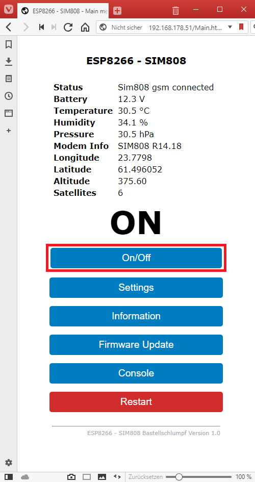

### User-manual of the web-interface
   

### Settings
   * If you have a connection to the web-interface first of all do the configuration.  
       Go to 'Settings'  
      

### Information
   

### Switch on/off
   

### Work with the console
   

