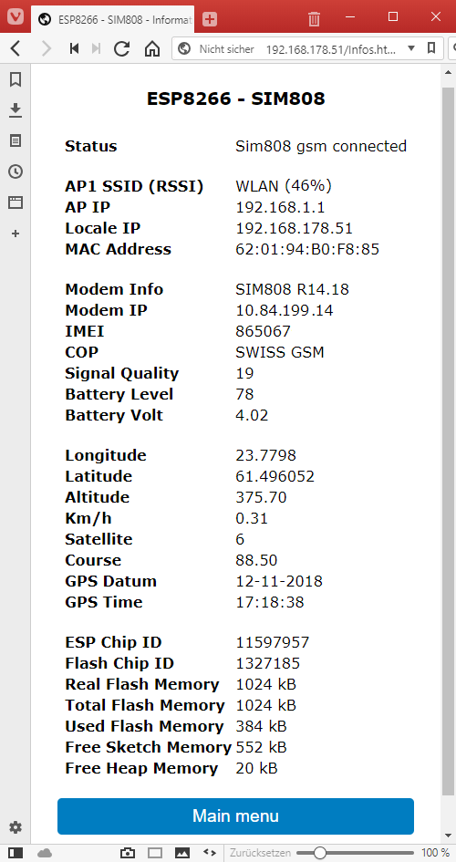
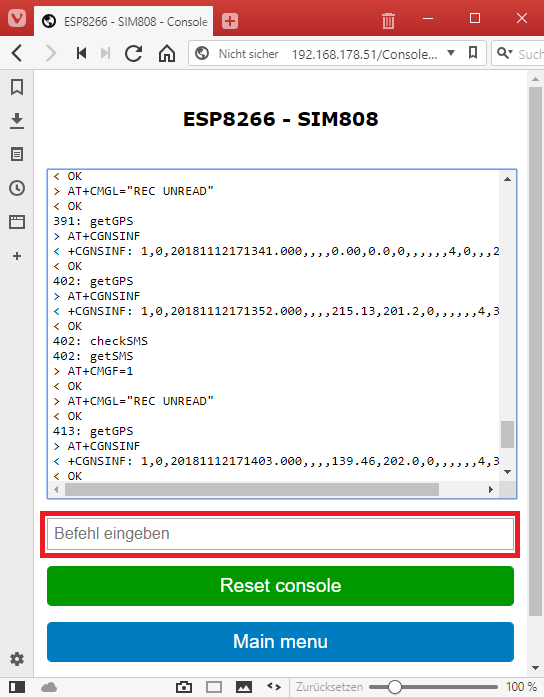

### Usermanual of the webinterface
   {: width=400px}

### Settings
   * If you have a connection to the webinterface first of all do the configuration.  
       Go to 'Settings'  
      {: width=400px}

### Information
   {: width=400px}

### Switch on/off
   {: width=400px}

### Work with the console
   {: width=400px}

