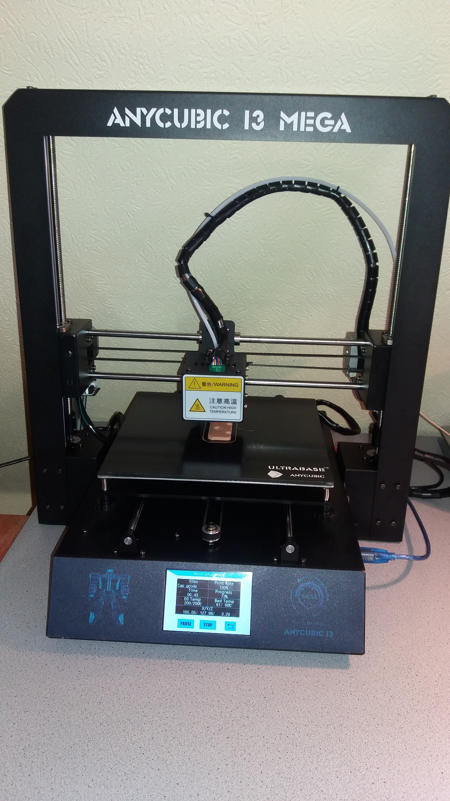
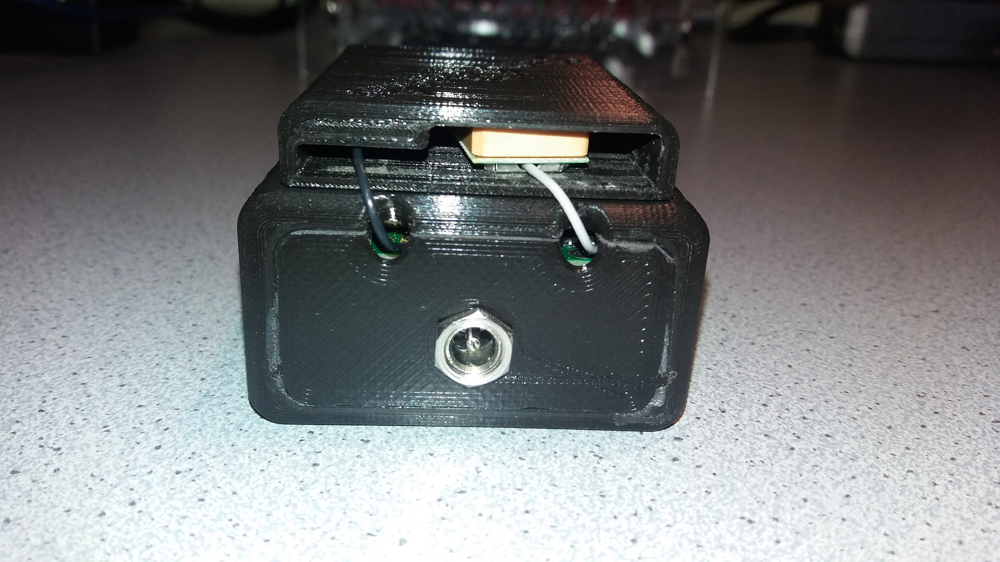
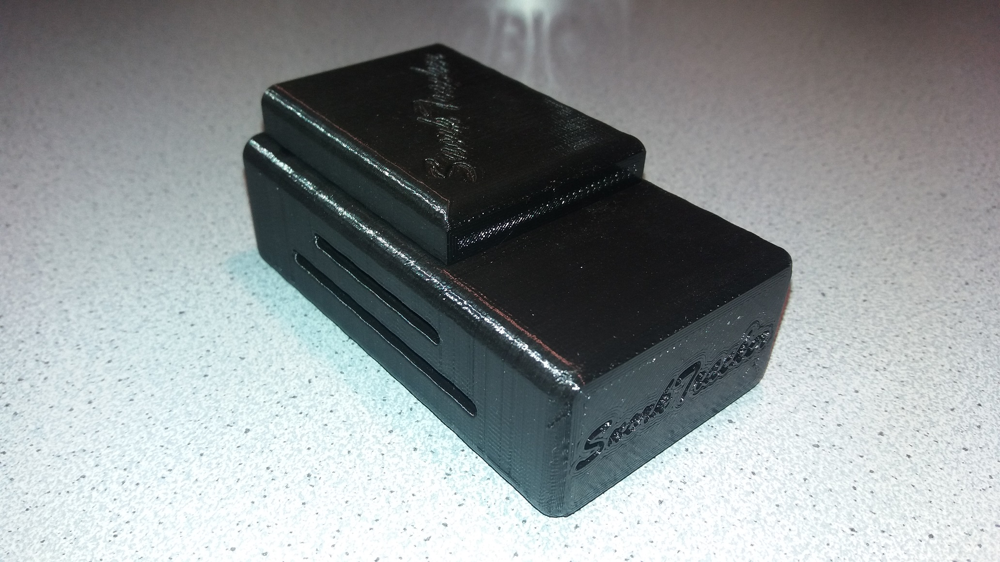
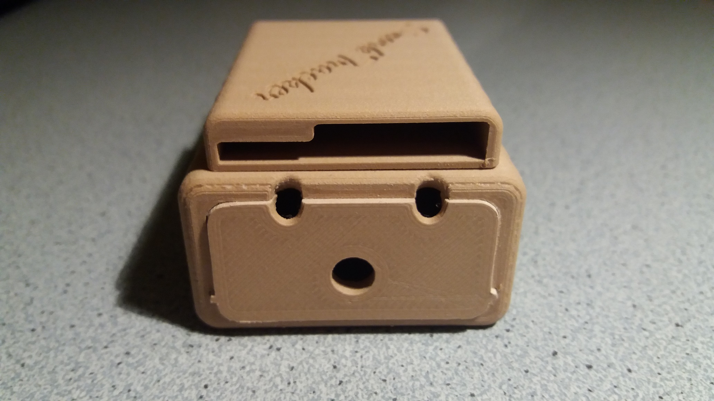
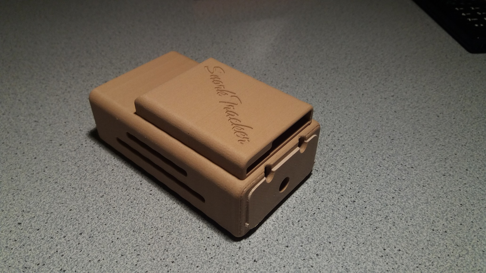

### Housing (Prototype)

Here are a prototype made of cardboard.

   

   

And here the AutoDesk 123D Design model for 3D printing.

You will find also the .stl files in the housing folder.

   

At the end I printed the Snorktracker with this great 3D printer in 10 hours.

   

Here the version in black

   

   

And here the version in PLA wood 

   

   
