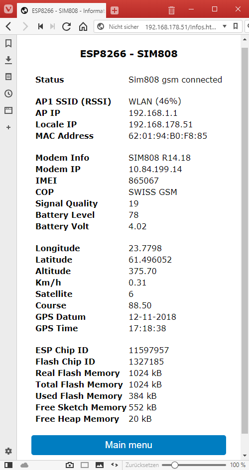

### Display system information
   

Note: Some of the informations may be not visible if the function is not enabled.

| Name | Sample | Description |
|------|--------|-------------|
|Status| Sim808 gsm connected |The current status of the wemos - sim808|
|AP1 SSID (RSSI)|WLAN (46%)|The name of the connected Wi-Fi access point and the qualitity of the signal.|
|Locale IP| 192.168.178.51 |The current IP of the Tracker|
| | | |
|Modem Info|SIM808 R14.18|The response of the SIM808 modem-info AT request|
|Modem IP|10.84.199.14|The IP of the gsm modul when connected to the INTERNET|
|IMEI|865067|The IMEI of your SIM card|
|COP|SWISS GSM|Your GSM operator|
|Signal Quality|19|The quality of the current signal|
|Battery Level|78|The quality of the power supply to the sim808 modul. This can be ignored because it should be fix with the DC-DC modul.|
|Battery Volt|4.02|The Volt of the power supply to the sim808 modul. This can be ignored because it should be fix with the DC-DC modul.|
| | | |
|Longitude|23.7798|The longitude value of your gps position.|
|Latitude|61.496052|The latitude value of your current gps position.|
|Altitude|375.70|The current altitude in meter|
|Km/h|0.31|The current speed in km/h|
|Satellites|6|The number of fix satellites for the current gps position|
|Course|88.50|The course in degrees|
|GPS Datum|12-11-2018|The datum from the gps satellites in UTC|
|GPS Time|17:18:38|The time from the gps satellites in UTC|
| | | |
|ESP Chip ID|11597957|The internal ID of the esp chip|
|Flash Chip ID|1327185|The internal ID of the ESP flash memory chip|
|Real Flash Memory|1024 kB|The actual chip size based on the flash id|
|Total Flash Memory|1024 kB|The size of the flash as set by the compiler|
|Used flash Memory|384 kB|The sketch size in memory|
|Free Sketch Memory|552 kB|The free sketch memory|
|Free Heap Memory|20 kB|Free heap memory for variables|

