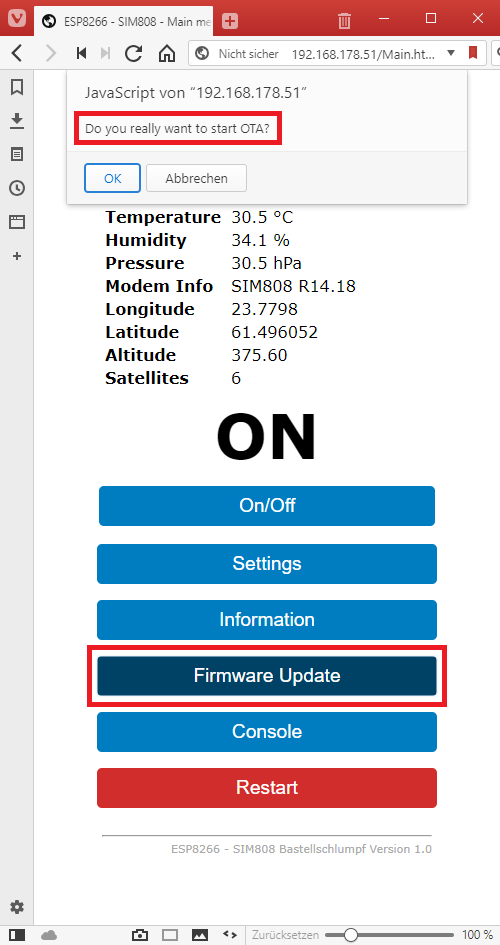

### Firmware Update 'over the air'

OTA (Over the Air) update is the process of loading the firmware into the Modul via a Wi-Fi connection and 
not via a serial port. This functionality can be very useful if the device is already installed or 
difficult to access.

For information about OTA, simply search the Internet for the keywords ESP8266 and OTA or take a look at the page:

 [**OTA Update ESP8266**](http://esp8266.github.io/Arduino/versions/2.0.0/doc/ota_updates/ota_updates.html)

Start the OTA functionality by pressing the 'Firmware update' button and answering the security question with Yes. 

   

If the OTA function could be started successfully, the following display appears:

   

And in your Arduino environment the OTA connection should be displayed under 'Port'. If this is not the case, 
sometimes restarting the Arduino IDE will help.

   

**Note:** Unfortunately this only works to update the Snorktracker software and not to transfer the SPIFFS web server files.