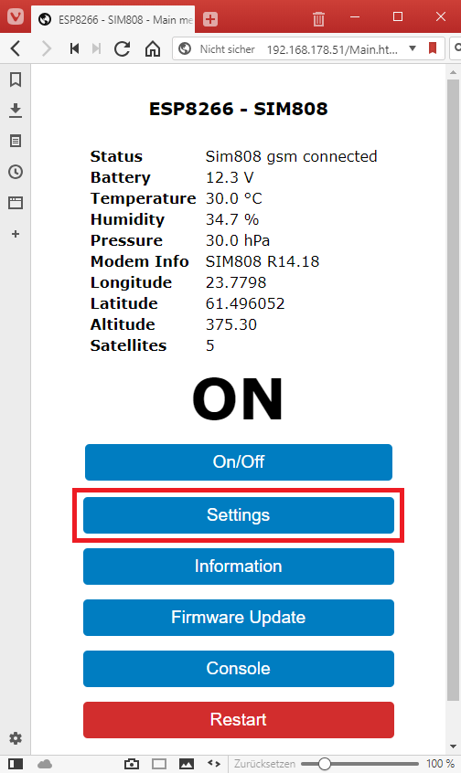
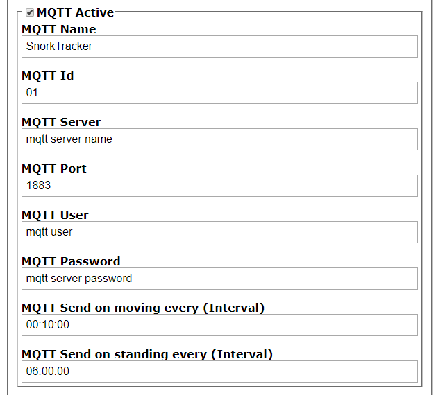

## Overview of the system settings

### Connect to the Web Interface
The easiest method is when the module automatically logs into your Wifi network. 
To do this you change the two defines **WIFI_SID** and **WIFI_PW** in Config.h before compiling.
If you supply then the system with power, it starts the integrated web server and logs into 
your WiFi network. You can use your router software to search for the new SnorkTracker IP.
You can then open a web browser and enter this new ip as http://xxx.xxx.xxx.xxx
Attention: The system does not support https yet so it only works if the URL starts with **http:**

If you have problems finding out the new IP, you can also simply search for the new access point 
called **SnorkTracker** in your WiFi settings and then connect to it.
If you have connected to this access point you can now connect with a browser. 
Since the system works with a captive portal and redirects all unknown urls to its own, 
it is sufficient if you enter a random http: - url.  
e.g. http://Dummy.html  
Make sure you use http and not https.

## Configure the details
If you now have access to the web server interface you can configure all the details via the 
**Settings** page.

All other settings are now described in detail below.

Hint: All Interval settings can be entered as '[days] hours:minutes:seconds' or just 'seconds'.

### WiFi Settings

If not configured via the **Config.h** file you can change here the access point name and 
password to your WiFi.

### GPRS Settings

Be sure that you have inserted a valid SIM card with a valid contract into the SIM card slot
of the SIM808. Note that the system connects without a password.
So the easiest way to check if the system works without a password and to check if it can connect
to a GPRS network is to put it into a mobile phone and check on start for password query and 
browsing functionality.

To connect to the Internet different gprs provider use different gprs access point names.
For example, sunrise uses the access point name 'INTERNET' and swisscom the name 'gprs.swisscom.ch'.
Search the Internet for the access point name of your provider.

### Enable debugging

The system has possibility to put more detailed information to the console window.
If you want to know i.e. the detailed communication between the esp8266 and the sim808 module
you can switch on here the display of this information.
For performance reason it is better to switch off this if it is not needed.

### Enable environment sensor

The system is connected to a BME280 sensor. This sensor can scan the temperature, humidity and
the pressure of its environment.
With this settings you can control the interval of the scan. These environment values doe not change so 
often so it is enough if this interval is set to a bigger value like 1 minute or bigger. 

### SMS Settings

If the system is switched on and it has a valid gprs connection details of it can be controlled 
via incoming sms.
Here you can set the interval of this sms check.

### GPS Settings

If the system is switched on you can also switch on the gps check functionality and the
gps check interval here.
Remember that it can take up to a minute for the sim808 module to receive a valid gps signal.
If you configure a gps check interval below this the system waits until it has a valid gps value.

### MQTT Settings

With this settings part you can configure the mqtt connection to your mqtt server.
If the system has a valid mqtt server connection it sends only the information that are valid
at this moment. So, for example if you switched off the gps then this information could not be 
send to your server.
If you have switched on the gps sending than you can additionally configure here how often the gps 
values should be send while your system is moving and how often if the system stands fix on one place.

Here is a screen shot of a mqtt server result in  
**ioBroker** software. See http://iobroker.net

Remember the system works with HTTP and not with HTTPS. So be sure you can connect with this
protocol to your MQTT server.

### Power Save Setting

If you connect the system to a battery it is important that you don't use to much power consumption.
Here you can configure that the system can detect if your battery is powered via a generator or not.
Make some tests how much voltage the battery has when charging and when not charging.
Then set a value between the two values here so the system can sleep if not charging.
It is better to set the active time to low value because the system waits with the sleep mode
if all the needed operations (gps, mqtt, sms) are done.

